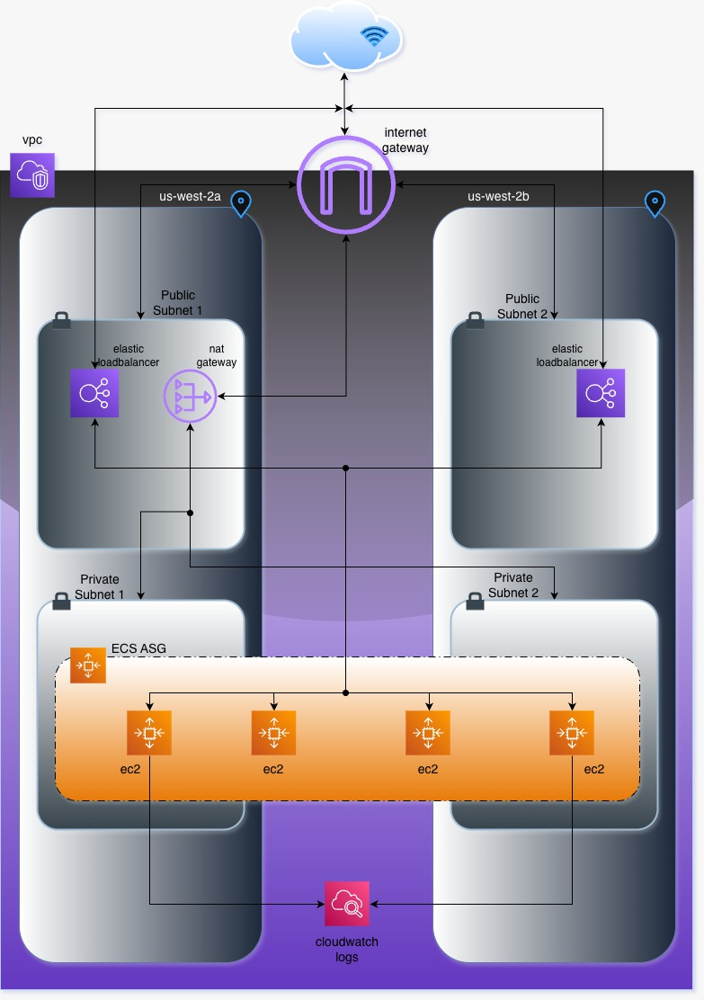

# Implementation Summary: AWS CloudFormation
_`It is recommended to test this script in a fresh AWS environment to avoid conflicts when creating roles, services or other resources.`_

This repository contains AWS CloudFormation templates located in the `cf-templates` directory.
These templates provision the core AWS infrastructure components; VPC, ECS and ELB. A simple **Python** application along with its Dockerfile is available in the `app` directory. The **GitHub Actions** workflows for building, deploying, and automating tasks are defined under the `.github/workflows` directory and all supporting **scripts** are located in the `scripts` directory.

The cloudformation templates support multi-region deployment. Stacksets are created in Admin Account and Stack Instances are created in Target Account. Relevant references are taken from AWS documentation [here](https://docs.aws.amazon.com/AWSCloudFormation/latest/UserGuide/stacksets-prereqs-self-managed.html). 

> ⚠️ **Important:** The script initially creates a CloudFormation StackSet **execution role** with **Administrator Access**.  
> Before deploying the StackSet, this role is replaced with a **custom minimal IAM policy** (created by the script) that grants access only to the specific AWS services required for provisioning. This ensures least-privilege access while maintaining the necessary functionality.


>ℹ️ Info: You can test the template using same Account ID for both admin and target AWS account.

## What do the scripts do?

### `prerequisites.sh`

> This script installs all the necessary IAM roles and creates an S3 bucket (with a specified prefix) where the CloudFormation templates will be uploaded.  
>
> It should be executed **before running the deploy script**.  
>
> The script expects three arguments:  
> 1. `bucket_name` – Name of the S3 bucket to be created  
> 2. `bucket_prefix` – Prefix under which templates will be stored  
> 3. `admin_aws_account_id` – AWS Account ID with admin permissions(preferred)  
>

### `deploy.sh`
> This script creates StackSet in the AWS Admin account and Stack Instances in the AWS Target account. It uses the template that is uploaded in S3 bucket which is done using prerequisites script. 
>
> The script expects six arguments:  
> 1. `bucket_name` – Name of the S3 bucket to be created  
> 2. `bucket_prefix` – Prefix under which templates will be stored  
> 3. `admin_aws_account_id` – AWS Account ID with admin permissions
> 4. `target_aws_account_id` – AWS Account ID where AWS Infrastructure is to be deployed
> 5. `target_aws_account_region` – AWS Region where AWS Infrastructure is to be deployed
> 6. `stackset_name` – Cloudformation Stackset name which will be deployed in Admin Account
>

## How does the CI/CD pipeline work?

> The primary GitHub Actions workflow file executed is `cicd.yaml`, located under the `.github/workflows` directory, followed by `build.yaml`.  
>
> The `cicd.yaml` file defines the **pipeline trigger logic**. In this case, it triggers on changes to the **`main`** branch. It then calls the `build.yaml` workflow to initiate the pipeline stages while loading the required **GitHub Actions environment**.
>
> A **`dev` GitHub Actions Environment** has been created to make the pipeline modular. This approach allows reusing the same pipeline for other environments such as **staging**, **UAT**, and **production** by simply changing the environment configuration.  
>
> Within the `dev` environment, both **Environment Secrets** and **Environment Variables** are defined as follows:
>
> **Environment Secrets**
> - `AWS_ACCESS_KEY_ID`  
> - `AWS_SECRET_ACCESS_KEY`  
> - `DOCKER_TOKEN`  
>
> **Environment Variables**
> - `AWS_ADMIN_ACCOUNT_ID`  
> - `AWS_ADMIN_REGION`  
> - `AWS_TARGET_ACCOUNT_ID`  
> - `AWS_TARGET_REGION`  
> - `BUCKET_NAME`  
> - `BUCKET_PREFIX`  
> - `DOCKER_USERNAME`  
> - `STACKSET_NAME`
>
> At the final stage, the deployed endpoint is tested using the `curl` command.  
> The Python application handles **GET requests** for both the `/` and `/hello` routes.

## AWS Infrastructure Overview



The AWS infrastructure consists of a **VPC** configured with four subnets, two **public** and two **private** distributed across **two separate Availability Zones (AZs)** for high availability.

An **Internet Gateway (IGW)** is attached to the public subnets to enable outbound internet access. For the private subnets, a **NAT Gateway** is provisioned to allow secure outbound internet connectivity without exposing the instances directly.

The **Python application** runs on **AWS ECS (EC2 launch type)** for cost optimization. The **EC2 instances** hosting the ECS tasks are deployed in the **private subnets** to enhance security and ensure high availability by being spread across two AZs.

An **Application Load Balancer (ALB)** is deployed in the **public subnets**, also across two AZs, to distribute incoming traffic evenly and maintain high availability.


## Run from your terminal

*`Before running the scripts, ensure that your AWS CLI is properly configured with valid **Access Key** and **Secret Key** credentials.`* 

⚠️ Note: Ensure that your AWS credentials have sufficient permissions to create IAM roles, S3 buckets, and CloudFormation StackSets. Running with limited permissions may cause the scripts to fail.

> ℹ️ **Info:**  
> Run the `prerequisites.sh` script located in the `scripts` directory **first**, followed by the `deploy-terminal.sh` script.  
> Make sure to execute the commands **from the root directory**, not inside the `scripts` folder.
>
**Example: Run prerequisites script**
> ```bash
> bash ./scripts/prerequisites.sh my-test-bucket templates 112233445566
> ```

Now run the deploy script.
>
**Example: Run deploy-terminal script**
> ```bash
> bash ./scripts/deploy-terminal.sh my-test-bucket templates 112233445566 889977665522 us-west-2 my-stackset
> ```

## ✅ **CONCLUSION**  
> On the closing note, I have successfully provisioned AWS Services through CI/CD pipeline on different `SANDBOX ENVIRONMENTS`. 
> You can verify the deployment details in the **Actions** tab or view them [here](https://github.com/aashhik/lalals-cloudformation-assessment/actions).